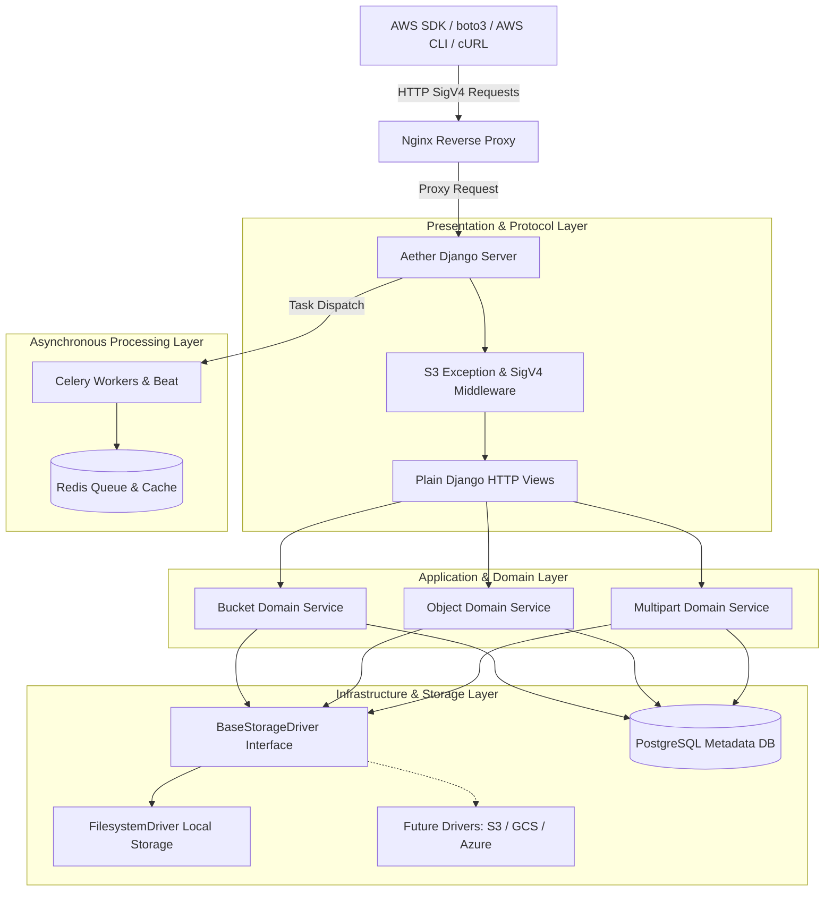
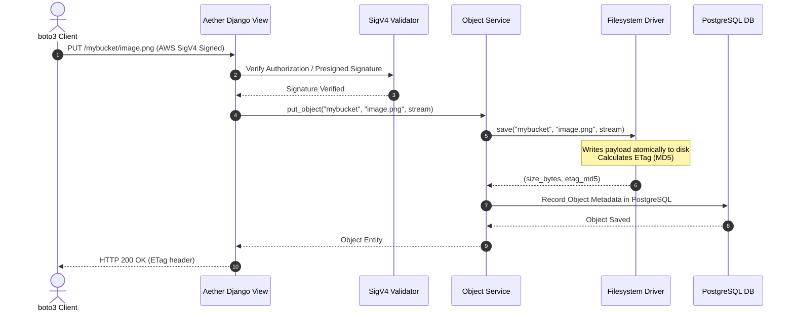
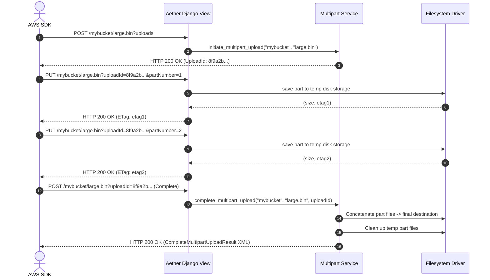

# Aether: Open-Source S3-Compatible Object Storage Server

[](https://www.python.org/)
[](https://www.djangoproject.com/)
[](https://aws.amazon.com/s3/)
[](LICENSE)

**Aether** is a production-quality, open-source, S3-compatible Object Storage Server built entirely in Python using Django 5.x, PostgreSQL, Redis, Celery, and Nginx.

The primary goal of Aether is API compatibility with Amazon Web Services (AWS) S3. Standard applications, libraries, and tools can seamlessly migrate between AWS S3 and Aether by changing only the `endpoint_url` configuration—no custom SDK required.

---

## 📐 Architecture & Design Principles

Aether adheres strictly to Clean Architecture principles, ensuring clear separation of concerns across presentation, application, domain, and infrastructure layers.

```
aether/
├── apps/
│   ├── auth/          # User & AWS AccessKey / SecretKey credentials
│   ├── buckets/       # S3 Bucket management & REST views
│   ├── objects/       # S3 Object operations, streaming & range downloads
│   ├── multipart/     # S3 Multipart upload engine & part stitching
│   ├── signatures/    # AWS Signature Version 4 (SigV4) verification
│   ├── versions/      # Object versioning & deletion markers
│   ├── policies/      # Bucket policies & access evaluation engine
│   ├── lifecycle/     # S3 Lifecycle rule engine & Celery background tasks
│   ├── notifications/ # Event notification webhooks (ObjectCreated, ObjectDeleted)
│   └── audit/         # Audit logging & storage quota enforcement
├── core/              # Shared S3 exception mappings, XML serializers, middleware
├── config/            # Django settings, URLs, Celery setup, WSGI/ASGI
├── storage/           # Pluggable storage driver engine
│   └── drivers/
│       ├── base.py       # BaseStorageDriver abstract interface
│       ├── filesystem.py # FilesystemDriver local disk implementation
│       ├── future_s3.py  # Future remote S3 driver stub
│       ├── future_gcs.py # Future GCS driver stub
│       └── future_azure.py # Future Azure Blob driver stub
├── tests/
│   ├── unit/         # Unit tests for SigV4, Storage Driver, XML, Utilities
│   ├── integration/  # Integration tests for Domain Services
│   └── s3_boto3/     # Real AWS boto3 SDK end-to-end integration test suite
├── docker/           # Dockerfile, docker-compose.yml, nginx.conf
└── docs/             # MkDocs technical documentation
```

### Architecture Diagram



---

## 🔄 Sequence Diagrams

### 1. Object Upload Sequence (`PUT /<bucket>/<key>`)



### 2. Multipart Upload Sequence



---

## ⚡ Supported S3 API Matrix

| HTTP Method | Resource / Query | S3 Action Name | Description | Status |
|---|---|---|---|---|
| `GET` | `/` | `ListBuckets` | List all buckets owned by user | ✅ Supported |
| `PUT` | `/<bucket>` | `CreateBucket` | Create new S3 bucket | ✅ Supported |
| `DELETE` | `/<bucket>` | `DeleteBucket` | Delete an empty bucket | ✅ Supported |
| `HEAD` | `/<bucket>` | `HeadBucket` | Check bucket existence & permissions | ✅ Supported |
| `GET` | `/<bucket>?list-type=2` | `ListObjectsV2` | List bucket contents with prefix & delimiter | ✅ Supported |
| `PUT` | `/<bucket>/<key>` | `PutObject` | Upload binary object payload | ✅ Supported |
| `GET` | `/<bucket>/<key>` | `GetObject` | Download object (Streaming & Range support) | ✅ Supported |
| `HEAD` | `/<bucket>/<key>` | `HeadObject` | Retrieve object metadata headers | ✅ Supported |
| `DELETE` | `/<bucket>/<key>` | `DeleteObject` | Delete object or create delete marker | ✅ Supported |
| `PUT` | `/<bucket>/<key>` + Header | `CopyObject` | Copy object across keys/buckets | ✅ Supported |
| `POST` | `/<bucket>/<key>?uploads` | `CreateMultipartUpload` | Initiate multipart upload | ✅ Supported |
| `PUT` | `/<bucket>/<key>?uploadId=...` | `UploadPart` | Upload individual part chunk | ✅ Supported |
| `GET` | `/<bucket>/<key>?uploadId=...` | `ListParts` | List uploaded part chunks | ✅ Supported |
| `POST` | `/<bucket>/<key>?uploadId=...` | `CompleteMultipartUpload` | Combine parts into final object | ✅ Supported |
| `DELETE` | `/<bucket>/<key>?uploadId=...` | `AbortMultipartUpload` | Cancel upload and clean temp parts | ✅ Supported |

---

## 🚀 Step-by-Step Execution Guide

### Option 1: Run via Docker Compose (Production Environment)

1. **Clone the repository**:
   ```bash
   git clone https://github.com/aether-storage/aether.git
   cd Aether
   ```

2. **Start the complete stack with Docker Compose**:
   ```bash
   docker compose -f docker/docker-compose.yml up --build -d
   ```
   This command provisions and launches:
   - `postgres`: PostgreSQL 16 database for metadata
   - `redis`: Redis 7 in-memory cache and Celery broker
   - `django`: Aether Web Server listening on `http://localhost:8000`
   - `celery`: Async worker for lifecycle and webhook tasks
   - `celery-beat`: Scheduled background task trigger
   - `nginx`: Reverse proxy handling client requests on port 80

3. **Check cluster status**:
   ```bash
   docker compose -f docker/docker-compose.yml ps
   ```

4. **View logs**:
   ```bash
   docker compose -f docker/docker-compose.yml logs -f django
   ```

5. **Stop services**:
   ```bash
   docker compose -f docker/docker-compose.yml down -v
   ```

---

### Option 2: Local Development Setup

1. **Create and activate Python 3.13 virtual environment**:
   ```bash
   python3 -m venv venv
   source venv/bin/activate
   ```

2. **Install dependencies**:
   ```bash
   pip install -r requirements-dev.txt
   ```

3. **Apply database migrations**:
   ```bash
   python manage.py makemigrations
   python manage.py migrate
   ```

4. **Run development server**:
   ```bash
   python manage.py runserver 0.0.0.0:8000
   ```

5. **Execute test suite**:
   ```bash
   pytest tests/ -v
   ```

---

## 💻 Code Examples & SDK Integration

### 1. Python (`boto3`)

```python
import boto3

# Initialize boto3 S3 client pointing to Aether
s3 = boto3.client(
    "s3",
    endpoint_url="http://localhost:8000",
    aws_access_key_id="admin",
    aws_secret_access_key="password",
    region_name="us-east-1",
    config=boto3.session.Config(signature_version="s3v4"),
)

# 1. Create Bucket
s3.create_bucket(Bucket="my-app-bucket")

# 2. Put Object (Upload)
s3.put_object(
    Bucket="my-app-bucket",
    Key="photos/vacation.jpg",
    Body=b"IMAGE_BINARY_DATA",
    ContentType="image/jpeg",
)

# 3. Get Object (Download)
response = s3.get_object(Bucket="my-app-bucket", Key="photos/vacation.jpg")
content = response["Body"].read()

# 4. Partial Range Download (Bytes 0-4)
range_res = s3.get_object(Bucket="my-app-bucket", Key="photos/vacation.jpg", Range="bytes=0-4")
partial_data = range_res["Body"].read()

# 5. List Objects (V2)
list_res = s3.list_objects_v2(Bucket="my-app-bucket", Prefix="photos/", Delimiter="/")
for item in list_res.get("Contents", []):
    print("Found key:", item["Key"], "Size:", item["Size"])

# 6. Generate Presigned URL
url = s3.generate_presigned_url(
    "get_object",
    Params={"Bucket": "my-app-bucket", "Key": "photos/vacation.jpg"},
    ExpiresIn=3600,
)
print("Presigned URL:", url)
```

### 2. AWS CLI

```bash
# Set credentials
export AWS_ACCESS_KEY_ID="admin"
export AWS_SECRET_ACCESS_KEY="password"
export AWS_DEFAULT_REGION="us-east-1"

# Create Bucket
aws --endpoint-url http://localhost:8000 s3 mb s3://my-cli-bucket

# Upload File
aws --endpoint-url http://localhost:8000 s3 cp myfile.txt s3://my-cli-bucket/myfile.txt

# List Objects
aws --endpoint-url http://localhost:8000 s3 ls s3://my-cli-bucket/

# Download File
aws --endpoint-url http://localhost:8000 s3 cp s3://my-cli-bucket/myfile.txt downloaded.txt
```

### 3. Java SDK (`software.amazon.awssdk`)

```java
import software.amazon.awssdk.auth.credentials.AwsBasicCredentials;
import software.amazon.awssdk.auth.credentials.StaticCredentialsProvider;
import software.amazon.awssdk.regions.Region;
import software.amazon.awssdk.services.s3.S3Client;
import software.amazon.awssdk.services.s3.model.*;

import java.net.URI;

public class AetherJavaApp {
    public static void main(String[] args) {
        S3Client s3 = S3Client.builder()
                .endpointOverride(URI.create("http://localhost:8000"))
                .credentialsProvider(StaticCredentialsProvider.create(
                        AwsBasicCredentials.create("admin", "password")))
                .region(Region.US_EAST_1)
                .build();

        s3.createBucket(CreateBucketRequest.builder().bucket("java-demo-bucket").build());
        System.out.println("Bucket created via Java SDK!");
    }
}
```

### 4. Go SDK (`aws-sdk-go-v2`)

```go
package main

import (
	"context"
	"fmt"
	"github.com/aws/aws-sdk-go-v2/aws"
	"github.com/aws/aws-sdk-go-v2/config"
	"github.com/aws/aws-sdk-go-v2/credentials"
	"github.com/aws/aws-sdk-go-v2/service/s3"
)

func main() {
	cfg, _ := config.LoadDefaultConfig(context.TODO(),
		config.WithRegion("us-east-1"),
		config.WithCredentialsProvider(credentials.NewStaticCredentialsProvider("admin", "password", "")),
		config.WithEndpointResolverWithOptions(aws.EndpointResolverWithOptionsFunc(
			func(service, region string, options ...interface{}) (aws.Endpoint, error) {
				return aws.Endpoint{URL: "http://localhost:8000"}, nil
			})),
	)

	client := s3.NewFromConfig(cfg)
	_, err := client.CreateBucket(context.TODO(), &s3.CreateBucketInput{
		Bucket: aws.String("go-demo-bucket"),
	})
	if err == nil {
		fmt.Println("Bucket successfully created with Go SDK!")
	}
}
```

---

## 🎨 Quality & Developer Tooling

Convenient Makefile shortcuts are provided:

- `make install`: Install development dependencies
- `make dev`: Run Django development server
- `make test`: Run complete pytest suite
- `make lint`: Run `ruff`, `black`, `isort`, `mypy` static quality checks
- `make format`: Auto-format code using `black`, `isort`, `ruff`
- `make docker-up`: Spin up Docker Compose environment
- `make docker-down`: Stop Docker Compose services

---

## 📄 License

This project is licensed under the MIT License.
